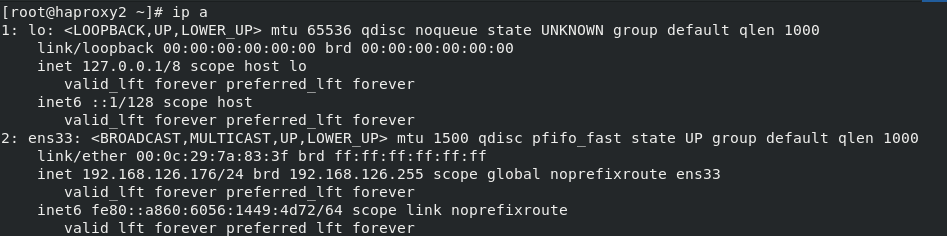

# HA-k3s-cluster
Hight-availabe k3s  cluster with HAproxy and keepalived 

# Setting up HA  k3s cluster 

## What is K3s?

K3s is a fully compliant Kubernetes distribution with the following enhancements:
Packaged as a single binary.

-   Lightweight storage backend based on sqlite3 as the default storage
    mechanism. etcd3, MySQL, Postgres also still available.

-   Wrapped in simple launcher that handles a lot of the complexity of
    TLS and options.

-   Secure by default with reasonable defaults for lightweight
    environments.

-   Simple but powerful "batteries-included" features have been added,
    such as: a **local storage provider, a service load balancer, a Helm
    controller, and the Traefik ingress controller.**

-   Operation of all Kubernetes control plane components is encapsulated
    in a single binary and process. This allows K3s to **automate and
    manage complex cluster operations** like distributing certificates.

-   **External** dependencies have been minimized (just a modern kernel
    and cgroup mounts needed). K3s packages the required dependencies,
    including:

containerd

Flannel

CoreDNS

CNI

Host utilities (iptables, socat, etc)

Ingress controller (traefik)

Embedded service loadbalancer

Embedded network policy controller

## Architecture

 

# What is HAproxy ?

HAProxy is a high-performance, open-source[ load
balancer](https://www.techtarget.com/searchnetworking/definition/load-balancing) and
reverse proxy
for[ TCP](https://www.techtarget.com/searchnetworking/definition/TCP) and[ HTTP](https://www.techtarget.com/whatis/definition/HTTP-Hypertext-Transfer-Protocol) applications.
Users can make use of HAProxy to improve the performance of websites and
applications by distributing their workloads. Performance improvements
include minimized response times and increased throughput. HAProxy is
used in high traffic services such
as[ GitHub](https://www.techtarget.com/searchitoperations/definition/GitHub) and
Twitter.  

To understand more how to set haproxy configuration :

<https://www.haproxy.com/blog/the-four-essential-sections-of-an-haproxy-configuration/#:~:text=There%20are%20four%20essential%20sections,routed%20to%20your%20backend%20servers>[.]

# What is Keepalived ?

Keepalived provides frameworks for both load balancing and high
availability which drives all the websites on We Push Buttons servers.
Keepalived implements a set of different checks and balances to
dynamically and adaptively maintain and manage server pools based on
their health.

# What is rancher ?

Rancher is a open-source software stack for teams adopting containers.
It addresses the operational and security challenges of managing
multiple Kubernetes clusters across any infrastructure, while providing
DevOps teams with integrated tools for running containerized workloads.

**There are many Kubernetes version we will be talking about latest
version Rancher 2.6**

-   Rancher was originally built to work with multiple orchestrators,
    and it included its own orchestrator called **Cattle**. With the
    rise of Kubernetes in the marketplace, Rancher 2 exclusively deploys
    and manages Kubernetes clusters running anywhere, on any provider.

-   can provision Kubernetes from a hosted provider, provision compute
    nodes and then install Kubernetes onto them, or import existing
    Kubernetes clusters running anywhere.

-   One Rancher server installation can manage thousands of Kubernetes
    clusters and thousands of nodes from the same user interface.

-   adds significant value on top of Kubernetes, first by **centralizing
    authentication** and **role-based access control (RBAC)** for all of
    the clusters, giving global admins the ability to control cluster
    access from one location.

-   It then enables detailed **monitoring** and **alerting** for
    clusters and their resources, ships **logs** to external providers,
    and integrates directly with Helm via the Application Catalog. If
    you have an external **CI/CD** system, you can plug it into Rancher,
    but if you don't, Rancher even includes Fleet to help you
    automatically deploy and upgrade workloads.

-   **Using k3s with Rancher makes Kubernetes simple to install,
    lightweight yet high availability Kubernetes distribution that can
    be easily managed within the Rancher orchestration platform.**

# K3sup

This tool uses **ssh** to install k3s to a remote Linux host. it also
can be used to join existing Linux hosts into a k3s cluster as agents.
First, k3s is installed using the utility script from Rancher, along
with a flag for host\'s public IP so that TLS works properly.
The kubeconfig file on the server is then fetched and updated so that
you can connect from your laptop using kubectl.

k3sup was developed to automate what can be a very manual and confusing
process for many developers, who are already short on time. Once we\'ve
provisioned a VM with your favourite tooling, k3sup means you are only
60 seconds away from running kubectl get pods on your own computer. If
you are a local computer, you can bypass SSH with k3sup install \--local

Usage :

The k3sup tool is a client application which you can run on your own
computer. It uses SSH to connect to remote servers and creates a local
KUBECONFIG file on your disk. Binaries are provided for MacOS, Windows,
and Linux (including ARM).

**Cluster-ssh**

Cluster SSH is a tool available under Linux allowing to administer
several hosts at the same time via SSH, so when entering a command it
runs on all the hosts of the cluster, but by selecting a specific window
from the open ones we can execute a command in a single shell.

**ssh-keygen**
 is a tool for creating new authentication key pairs for
SSH. Such key pairs are used for automating logins, single sign-on, and
for authenticating hosts.

# HA cluster architecture 

 **CNAME**                 

Master1.medianet

Master2.medianet

worker1.medianet

HAproxy1.medianet

HAproxy2.medianet

**FQDN**

Master1.medianet.test

Master2.medianet.test

Master3.medianet.test

worker1.medianet.test

HAproxy1.medianet.test

HAproxy2.medianet.test

Rancher.medianet.test

# HAProxy and Keepalived Configuring

## step1 - Install HAProxy and Keepalived on both centos nodes.

    yum install haproxy

    yum install keepalived

Load balancing in HAProxy also requires the ability to bind to an IP
address that are nonlocal, meaning that it is not assigned to a device
on the local system. Below configuration is added so that
floating/shared IP can be assigned to one of the load balancers. Below
line get it done.

## Step2- Edit sysctl.conf file

    vim /etc/sysctl.conf

    net.ipv4.ip_nonlocal_bind=1          # add this line to sysctl.conf
    
    sysctl -p                            # to enable changes 

**Add the below configuration on the master node (HAproxy1.medianet)**

## step3- set keepalived 

let’s create keepalived.conf file on each instances.
 
 
        vim  /etc/keepalived/keepalived.conf

        global_defs {

        notification_email {

        }

        router_id LVS_DEVEL

        vrrp_skip_check_adv_addr

        vrrp_garp_interval 0

        vrrp_gna_interval 0

        }

        vrrp_script chk_haproxy {

        script \"killall -0 haproxy\"

        interval 2

        weight 2

        }

        vrrp_instance haproxy-vip {

        state BACKUP

        priority 100                                                     # priority

        interface ens33                                                  # Network card

        virtual_router_id 60

        advert_int 1

        authentication {

        auth_type PASS

        auth_pass 1111

        }

        unicast_src_ip 192.168.126.161                                   # The IP address of first machine

        unicast_peer {

        192.168.126.176                                                  # The IP address of peer machines

        }

        virtual_ipaddress {

        192.168.126.169/24                                               # The VIP address

        }

        }

        } track_script {

        chk_haproxy

 **Add the below configuration on the slave node (HAproxy2.medianet)**

        global_defs {

        notification_email {

        }

        router_id LVS_DEVEL

        vrrp_skip_check_adv_addr

        vrrp_garp_interval 0

        vrrp_gna_interval 0

        }

        vrrp_script chk_haproxy {

        script \"killall -0 haproxy\"

        interval 2

        weight 2

        }

        vrrp_instance haproxy-vip {

        state BACKUP

        priority 100                                       # priority

        interface ens33                                    # Network card

        virtual_router_id 60

        advert_int 1

        authentication {

        auth_type PASS

        auth_pass 1111

        }

        unicast_src_ip 192.168.126.176                      # The IP address of second machine

        unicast_peer {

        192.168.126.161                                     # The IP address of peer machines

        }

        virtual_ipaddress {

        192.168.126.169/24                                  # The VIP address

        }

        }

        } track_script {

        chk_haproxy

  ## step4- Restart Keepalived

        systemctl restart keepalived

## step4- configure HAProxy

    Now let's configure HAProxy on both instances. We'll have to do the
    below steps on master node as well as slave node.

        vi /etc/haproxy/haproxy.cfg

        global

        log /dev/log local0 warning

        chroot /var/lib/haproxy

        pidfile /var/run/haproxy.pid

        maxconn 4000

        user haproxy

        group haproxy

        daemon

        stats socket /var/lib/haproxy/stats level admin

        defaults

        log global

        option httplog

        option dontlognull

        timeout connect 5000

        timeout client 50000

        timeout server 50000

        frontend kube-apiserver

        bind \*:6443

        mode tcp

        option tcplog

        default_backend kube-apiserver

        backend kube-apiserver

        mode tcp

        option tcplog

        option tcp-check

        balance roundrobin

        default-server inter 10s downinter 5s rise 2 fall 2 slowstart 20s
        maxconn 250 maxqueue 256 weight 100

        server master1.medianet 192.168.126.172:6443 check inter 1s       # Change server name and ip with optinal ones 

        server master2.medianet 192.168.126.174:6443 check inter 1s       # Change server name and ip with optinal ones

        server master3.medianet 192.168.126.175:6443 check inter 1s       # Change server name and ip with optinal ones

# How to Enable HAProxy Stats

HAProxy Stats is a useful application that provides useful information
about total connection, data transfer, server state and more. Since it
is browser-based you can easily get live stats about your HAProxy
deployment via web browser. In this article, we will look at how to
enable HAProxy Stats in your system. Follow these steps only if after
you have installed and configured HAProxy on your server.

## Step1- Enable HAProxy Statistics

open HAproxy configuration file.

    vi /etc/haproxy/haproxy.cfg

Add the following lines in it, after 'defaults' section. Replace
192.168.126.161 with your server's IP address.

    listen stats 192.168.126.169:1936

    mode http

    log global

    maxconn 10

    clitimeout 100s

    srvtimeout 100s

    contimeout 100s

    timeout queue 100s

    stats enable

    stats hide-version

    stats refresh 30s

    stats show-node

    stats auth admin:123

    stats uri /haproxy/medianet

In the above code, the IP address in first line is the IP at which
HAProxy stats is available. Also, we have configured it to listen to
port 1936. When we try to access HAProxy stats via web browser, we will
be asked for username & password. The last but one line contains the
username and password as *admin*  and *"123"* respectively. We can
change it as per requirements . Also, the last line contains the URL at
which you can access HAProxy stats.

## Step2- Access HAProxy via web browser

*http://192.168.126.161:1936/haproxy/medianet*

 we will see a login prompt. And we'll enter
the username and password that have specified above

# Testing

Let’s check whether our configuration has been done correctly. Try executing ip addr on master node in my case its HAproxy2.medainet As you can see on the master node IP:192.168.126.176 is assigned

  

Try executing ip addr on slave node.

 

Let's stop the HAProxy on the master node(HAproxy1.medianet ) . Now
you can see that IP address *192.168.126.169/24* will be assigned to
 the slave node. If you start HAproxy instance on the master node IP
address *192.168.6.164* will be assigned back to master node.

# **Setting multi-master k3s cluster** 

## Step1 --- Download k3sup 

k3sup is distributed as a static Go binary.

    curl -sLS https://get.k3sup.dev \| sh

    sudo install k3sup /usr/local/bin/

## Step 2 --- use ssh-keygen to generate a new SSH key

     ssh-keygen -t rsa                 ## repeat it in all machines

     ssh-copy-id USER@IP              ##copy ssh keys to a remote VM with

 ### Install kubectl

    curl -LO \"https://dl.k8s.io/release/\$(curl -L -s
    https://dl.k8s.io/release/stable.txt)/bin/linux/amd64/kubectl\"

    install -o root -g root -m 0755 kubectl /usr/local/bin/kubectl

 ### Install First master

    k3sup install \

    --host=master1.medinaet \

    --user=root \

    --k3s-version=v1.21.7+k3s1 \

    --cluster \

    --tls-san 192.168.168.169 \                                                       # floating  VIP or load balancer IP

    --k3s-extra-args="--node-taint node-role.kubernetes.io/master=true:NoSchedule"    # No pod will be scheduled onto master node

###  Join master nodes

    k3sup join \

    --host=master2.medianet \

    --server-user=root \

    --server-host=192.168.126.169 \

    --user=root \

    --server \

    --k3s-extra-args="--node-taintnode-role.kubernetes.io/master=true:NoSchedule

 "

###  Join worker nodes

    k3sup join \

    --host=worker1.medainet \

    --server-user=root \

    --server-host=192.168.126.169 \

    --user=root

{width="6.257638888888889in"
height="1.0986111111111112in"}

 ### Verify cluster setup**

    K3s Kubectl get nodes

  # Setting Rancher server

    -   Two ways are available :

/ on Kubernetes cluster (RKE , RKE2 or K3s )

2/ on docker container

**I'll be using second option : Installing Rancher on a Single Node
Using Docker**

## **Step1- run rancher server :**

If installing Rancher in a development or testing environment where
identity verification isn't a concern, install Rancher using the
self-signed certificate that it generates. This installation option
omits the hassle of generating a certificate

 **Default Rancher-generated Self-signed Certificate**

    docker run -d --restart=unless-stopped \

    -p 80:80 -p 443:443 \

    --privileged \

    rancher/rancher:latest

## **step 2 - Log into your host, and run the command below:**

    https://localhost/

## **Step 3- To find login password and change run this command**

    docker ps                                                            # to get containe id rancher/rancher

    docker logs container_id 2\>&1 \| grep "Bootstrap Password:"         # to get password

We can Import any existing clusters under any distribution name or add
ones to rancher server so we can manage it form rancher CLI

To import an existing clusters, we need to copy these commands in the
desired host

At first the cluster will be in **pending** state bust after a while it
will change to **active** state

Adding cluster
